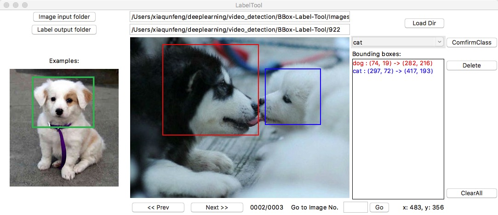

BBox-Label-Tool
===============

A simple tool for labeling object bounding boxes in images, implemented with Python Tkinter.

**Screenshot:**


Data Organization
-----------------
LabelTool  
|  
|--main.py   *# source code for the tool*  
|  
|--class.txt   *# your class-candidates file*  
|  
|--Images/   *# direcotry containing the images to be labeled*  
|  
|--Labels/   *# direcotry for the labeling results*  
|  
|--Examples/  *# direcotry for the example bboxes*  

Environment
----------
```
▶ python3 --version
Python 3.6.5
▶ python3
>>> import PIL
>>> PIL.__version__
'4.2.1'
```

Run
-------
```
▶ python3 main.py
3 images loaded from /Users/xiaqunfeng/deeplearning/video_detection/BBox-Label-Tool/Images/001
set label class to : cat
set label class to : dog
Image No. 1 saved
Image No. 2 saved
```

Usage
-----
0. The current tool requires that :
   * The input images dir.
   * The output labels dir.
   * You can choose those dir by button `Image input folder` and `Label output folder`, or input dir name in entry.
1. Click `Load Dir`. The images to be labeled in the folder, along with an example results will be loaded. The labeled file directory will automatically created if it does not  exist.
2. To create a new bounding box, left-click to select the first vertex. Moving the mouse to draw a rectangle, and left-click again to select the second vertex.
  - To cancel the bounding box while drawing, just press `<Esc>`.
  - To delete a existing bounding box, select it from the listbox, and click `Delete`.
  - To delete all existing bounding boxes in the image, simply click `ClearAll`.
3. After finishing one image, click `Next` to advance. Likewise, click `Prev` to reverse. Or, input an image id and click `Go` to navigate to the speficied image.
  - Be sure to click `Next` after finishing a image, or the result won't be saved. 
  - press 'p' to go prev image.
  - press 'n' to go next image.

4. If the image doesn't fit on screen, the tool will resizes both the bounding box and image on loading and back again on saving.

5. For multi-class task, modify 'class.txt' with your own class-candidates and before labeling bbox, choose the 'Current Class' in the Combobox and make sure you click `ComfirmClass` button.

6. If the image filename is `foo.var.baz.jpg`, the labeled file name will be `foo.var.baz.txt`, not `foo.txt` .
7. Support multiple image formats: `"*.JPEG", "*.jpeg", "*JPG", "*.jpg", "*.PNG", "*.png", "*.BMP", "*.bmp"`.

Original  project address: [BBox-Label-Tool](https://github.com/puzzledqs/BBox-Label-Tool)


